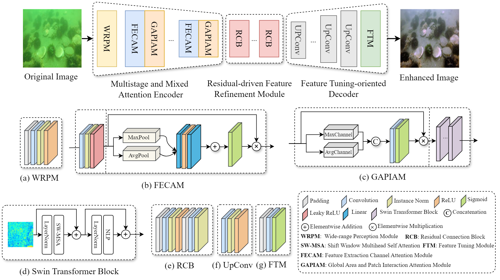

# ERD: Encoder-Residual-Decoder Neural Network for Underwater Image Enhancement

> [!WARNING]
>
> This repository is no longer maintained, please move to [UIP](https://github.com/fansuregrin/UIP)!
>
> 该仓库不再维护，请移步 [UIP](https://github.com/fansuregrin/UIP)！

This is the official PyTorch implementation of "ERD: Encoder-Residual-Decoder Nueral Network for Underwater Image Enhancement".



## Citation
```bibtex
@ARTICLE{erd,
  author={Cao, Jingchao and Peng, Wangzhen and Liu, Yutao and Dong, Junyu and Callet, Patrick Le and Kwong, Sam},
  journal={IEEE Transactions on Circuits and Systems for Video Technology}, 
  title={ERD: Encoder-Residual-Decoder Neural Network for Underwater Image Enhancement}, 
  year={2025},
  volume={},
  number={},
  pages={1-1},
  keywords={Image color analysis;Feature extraction;Transformers;Image quality;Training;Imaging;Image restoration;Image enhancement;Image edge detection;Degradation;Underwater image enhancement;Deep neural network;Residual learning;Attention;Fourier transform},
  doi={10.1109/TCSVT.2025.3556203}}
```