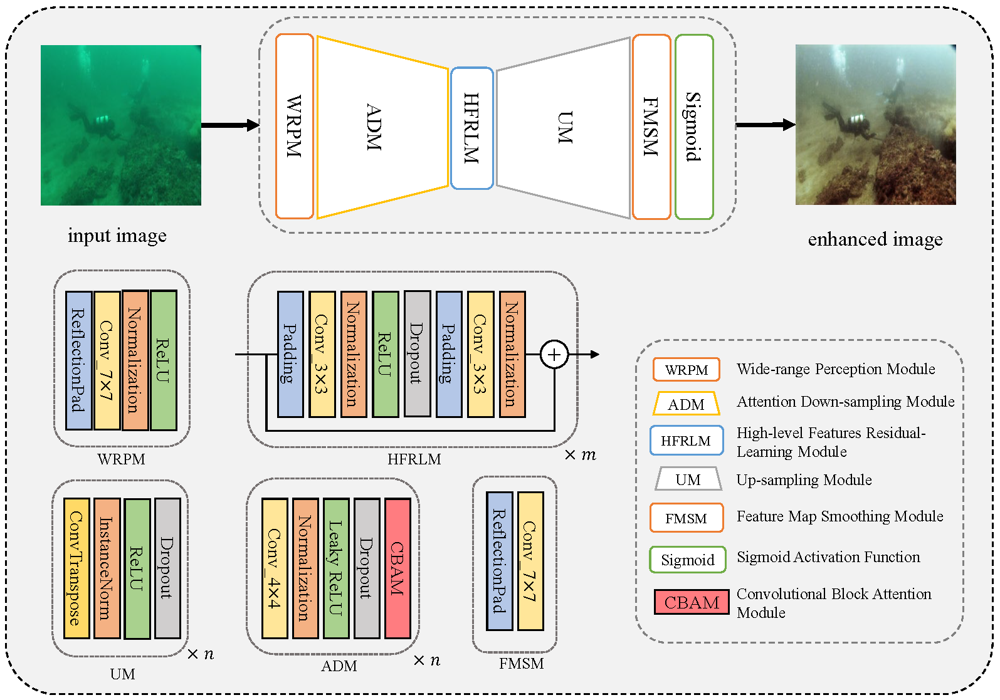
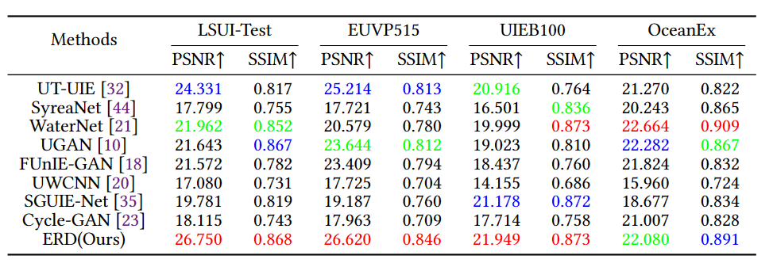
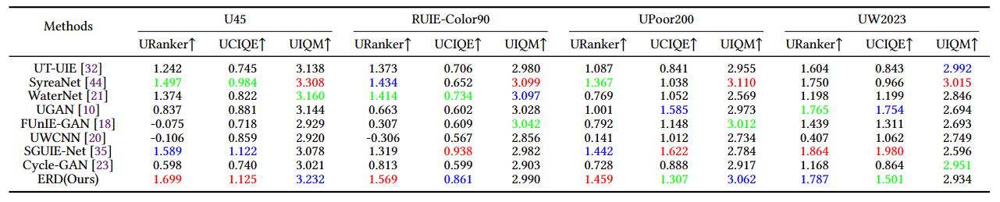

# ERD: Encoder-Residual-Decoder Nueral Network for Underwater Image Enhancement with Frequency Domain Loss and Edge Detection Loss.

## Introduction

This is the official PyTorch implementation of "ERD: Encoder-Residual-Decoder Nueral Network for Underwater Image Enhancement".

The proposed network mainly consists of attention down-sampling module (ADM), high-level features residual learning module (HFRLM) and down-sampling module (DM). The ADM can selectively focus on features in different channels and regions of the input image, and the HFRLM can purify and refine the representative features of various underwater images, thus improving the performance of enhancement process. Furthermore, we design the frequency domain loss and edge detection loss to train the proposed UIE network forthe first time. These two loss functions guide the network to retain more high-frequency information and objectdetails, ensuring that the enhanced image approximates the reference image in terms of color tone whilepreserving content and structure.

## Results

Table 1. The evaluations of different methods on four reference-based datasets in terms of average PSNR and SSIM values. The top three indicator values are marked in red (first), blue (second) and green (third), respectively.

Table 2. The evaluations of different methods on four reference-free datasets in terms of average URanker, UCIQE and UIQM values. The top three indicator values are marked in red (first), blue (second) and green (third), respectively.
