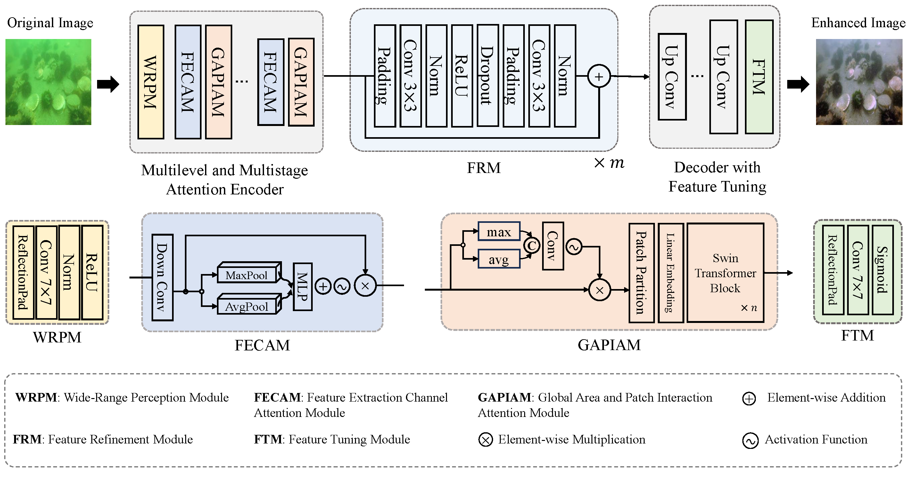

# ERD: Encoder-Residual-Decoder Nueral Network for Underwater Image Enhancement with Frequency Domain Loss and Edge Detection Loss.

## Introduction

This is the official PyTorch implementation of "ERD: Encoder-Residual-Decoder Nueral Network for Underwater Image Enhancement".

In underwater environments, the absorption and scattering of light often result in various types of degradation in captured images, including color cast, low contrast, low brightness, and blurriness. These undesirable effects pose significant challenges for both underwater photography and downstream tasks such as object detection, recognition, and navigation. To address these challenges, we propose a novel end-to-end underwater image enhancement (UIE) network via multidimensional attention mechanism and a residual-based feature refinement module, called ERD. Specifically, our network includes an encoder stage for extracting features from input underwater images with channel, spatial, and patch attention modules to emphasize degraded channels and regions for restoration; a residual stage for further purification of informative features through sufficient feature learning; and a decoder stage for effective image reconstruction. Inspired by visual perception mechanism, we design the frequency domain loss and edge details loss to retain more high-frequency information and object details while ensuring that the enhanced image approximates the reference image in terms of color tone while preserving content and structure. To comprehensively evaluate our proposed UIE model, we also curated three additional underwater image datasets through online collection and generation using Cycle-GAN. Rigorous experiments conducted on a total of eight underwater image databases demonstrate that the proposed UIE model outperforms state-of-the-art methods in enhancing both real-world and generated underwater images.

## Results

Table 1. The evaluations of different methods on four reference-based datasets in terms of average PSNR and SSIM values. The top three indicator values are marked in red (first), blue (second) and green (third), respectively.

Table 2. The evaluations of different methods on four reference-free datasets in terms of average URanker, UCIQE and UIQM values. The top three indicator values are marked in red (first), blue (second) and green (third), respectively.
